# Tennis Club 1.0

### Table of Contents  
- [Overview](#Overview)
- [Prerequisites](#prerequisites)  
- [Installation](#installation)  
- [Project Configuration](#project-configuration)  
- [Application Usage](#application-usage)  
- [Reservation Model](#reservation-model)  
- [Architecture](#architecture)
- [Tests](#tests)

## Overview  
This project is a simple Tennis Club application which allow to register new user, adding courts
and making game reservations.

## Prerequisites  
List the software and tools needed to run this project.  
Examples:  
- Python >= 3.13.0
- Django >= 5.1.4
- Virtualenv (for environment isolation)  
- SQLite3 - for debugging purposes  

## Installation  
1. Clone the repository:  
    ```bash  
    git clone https://github.com/pwalaszkowski/tclub.git
    cd tclub
    ```
   
2. Setup venv
    ```bash
    python -m venv .venv  
    source env/bin/activate
    ```

3. Install requirements
    ```bash
    python pip install -r requirements.txt 
    ```

## Project Configuration
1. Run following command makemigrations
    ```bash
    cd tennisclub
    python manage.py makemigrations
    python manage.py migrate
    ```
   
2. Create superuser
    ```bash
    python manage.py createsuperuser
    ```

3. Run development server
    ```bash
    python manage.py runserver  
    ```

4. Check the server is running
    ```bash 
    Visit http://127.0.0.1:8000/ in your browser to access your project.
    ```

5. Login screen should be visible

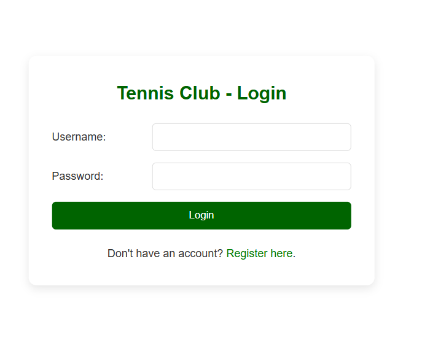

## Application Usage
1. Application allow user to login and register new Tennis Club Member


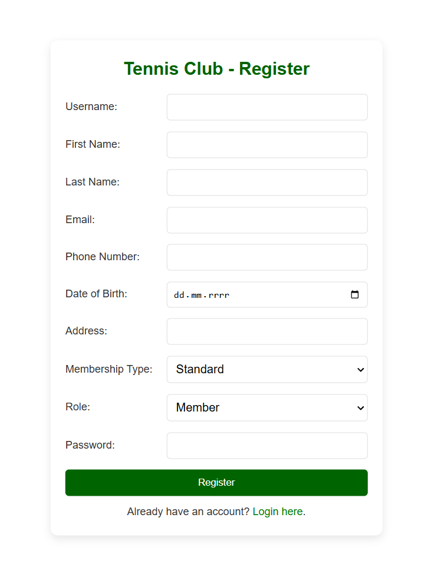

2. Display all team members with contact data to search partner for a game.

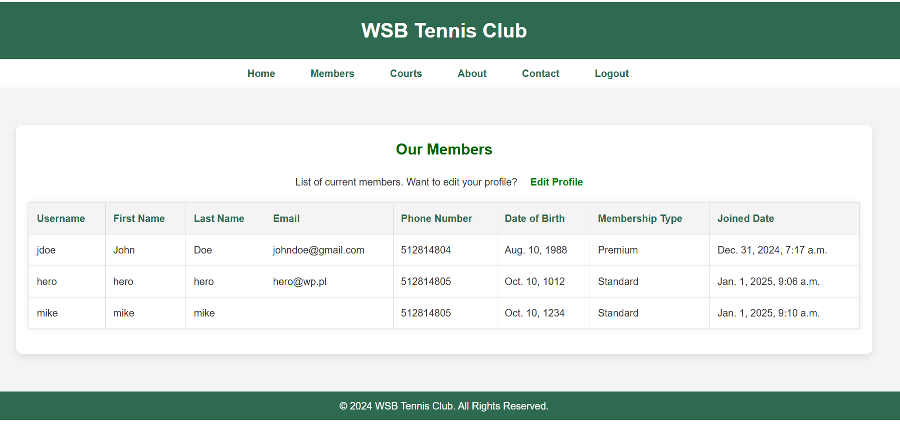

3. Edit current logged user profile.

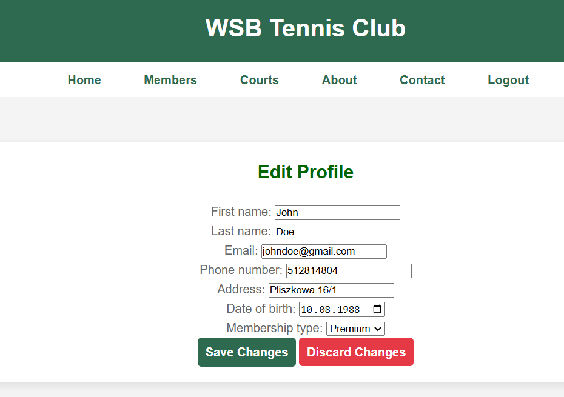

3. Add new court and display existing courts with their data.

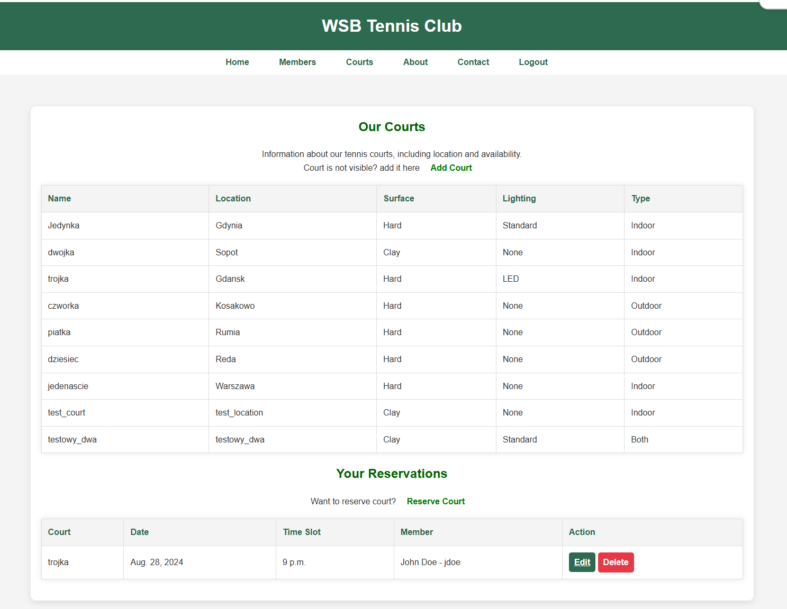

4. Reserve court by actually logged user and display reservations for user who is actually logged.

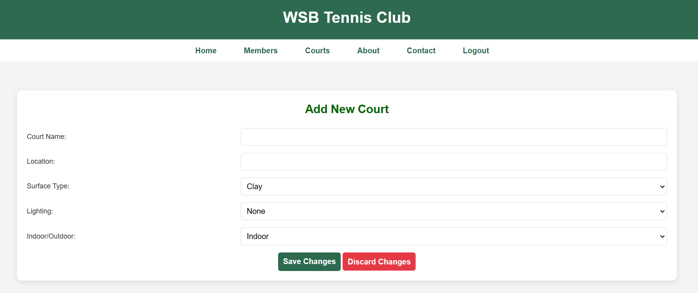

6. Manage reservations Edit/Delete.

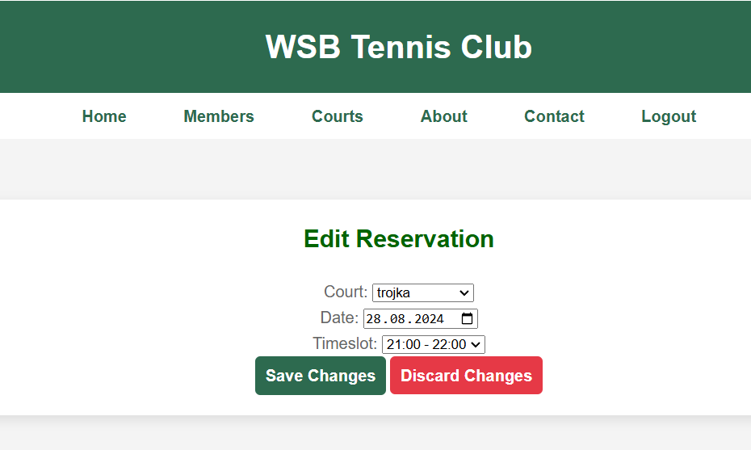

## Token Management
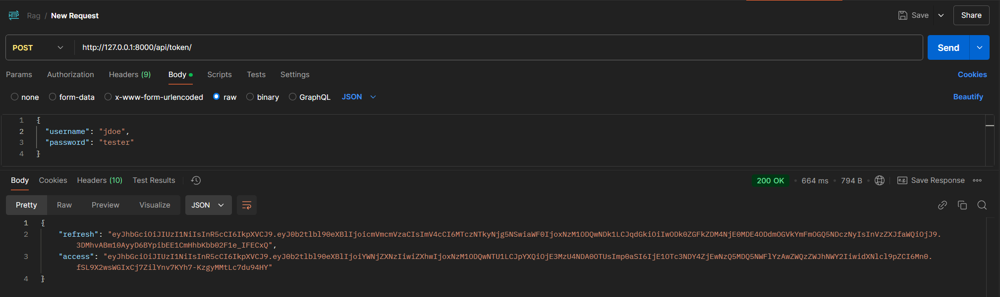

## Architecture
### Table of Contents  
- [TennisClubMember Model](#tennisclubmember-model)  
  - [Architecture Overview](#architecture-overview )  
  - [Fields and Attributes](#fields-and-attributes)  
  - [Methods](#methods)  
- [Court Model](#court-model)  
  - [Overview](#overview)  
  - [Fields and Attributes](#fields-and-attributes)  
- [Reservation Model](#reservation-model)  
  - [Overview](#overview)  
  - [Fields and Attributes](#fields-and-attributes)  

---

### TennisClubMember Model  
#### Architecture Overview  
The `TennisClubMember` model represents a member of the tennis club. It is linked to the built-in `User` model from Django for authentication purposes. Members have various attributes such as personal details, role, membership type, and contact information.  

#### Fields and Attributes  
- **user**: A one-to-one relationship with Django’s built-in `User` model. This is required for authentication.  
- **ROLE_CHOICES**: A tuple containing 'member' and 'admin', representing the possible roles for a member.  
- **first_name**: The member's first name.  
- **last_name**: The member's last name.  
- **email**: The member's email address (unique).  
- **phone_number**: The member's contact phone number.  
- **username**: A unique username.  
- **date_of_birth**: The member's date of birth.  
- **address**: The member’s address.  
- **joined_date**: The date and time when the member joined the club (automatically set to the current timestamp).  
- **membership_type**: The type of membership (choices: Standard, Premium, VIP). Defaults to 'Standard'.  
- **role**: The role of the member, which defaults to 'member'.  
- **is_active**: A Boolean field indicating whether the member is currently active (default: True).  
- **password**: The hashed password field to store the member’s password.  
- **last_login**: The date and time when the member last logged in (can be null or blank initially).  

##### Methods  
- **save**: Overridden to ensure the member's email and username are synced with the related `User` model.  
- **is_authenticated**: Returns `True` if the member is active, allowing for Django’s authentication system to work correctly.  
- **set_password(raw_password)**: Hashes and sets the member’s password.  
- **check_password(password)**: Checks if the provided password matches the stored hashed password.  

#### Meta Options  
- **ordering**: Orders members by their last name and first name.  
- **verbose_name**: 'Tennis Club Member' for display in Django admin.  
- **verbose_name_plural**: 'Tennis Club Members' for plural form in Django admin.  

---

### Court Model  

#### Overview  
The `Court` model represents the tennis courts available at the club. Courts have attributes like the type of surface, lighting, and whether they are indoor or outdoor.  

#### Fields and Attributes  
- **name**: A unique name identifying the court.  
- **location**: The physical location of the court (optional).  
- **surface**: The type of surface (choices: Clay, Grass, Hard, Synthetic). Defaults to 'hard'.  
- **lighting**: The type of lighting available (choices: None, Standard, LED). Defaults to 'none'.  
- **indoor_outdoor**: Whether the court is indoor, outdoor, or both (choices: Indoor, Outdoor, Both). Defaults to 'outdoor'.  

##### Methods  
- **__str__**: Returns a string representation of the court’s name.  

---

### Reservation Model  

#### Overview  
The `Reservation` model represents bookings made by Tennis Club members for specific courts and timeslots. A reservation is unique for a specific court, date, and timeslot.  

#### Fields and Attributes  
- **member**: A foreign key linking to the `TennisClubMember` model. Represents the member making the reservation.  
- **court**: A foreign key linking to the `Court` model. Represents the court being reserved.  
- **date**: The date for the reservation.  
- **timeslot**: The specific timeslot for the reservation, ranging from 7:00 AM to 10:00 PM in hourly slots.  

##### TIMESLOT_CHOICES  
The `timeslot` field offers choices for timeslots ranging from 7:00 AM to 10:00 PM.  

##### Meta Options  
- **unique_together**: Ensures that a combination of court, date, and timeslot is unique.  
- **ordering**: Orders reservations by date and timeslot.  

##### Methods  
- **__str__**: Returns a string representation of the court name, date, and timeslot.  

---

## Tests
1. Running tests
    ```bash
    python manage.py test
    ```
   
2. Tests status
* Master [](https://github.com/pwalaszkowski/tclub/actions/workflows/ci.yaml)
* Develop [](https://github.com/pwalaszkowski/tclub/actions/workflows/ci.yaml)

## PWA
1. Launch application in Chrome, open devtools and navigate to application section.
2. Confirm that:
* manifest.json is working 
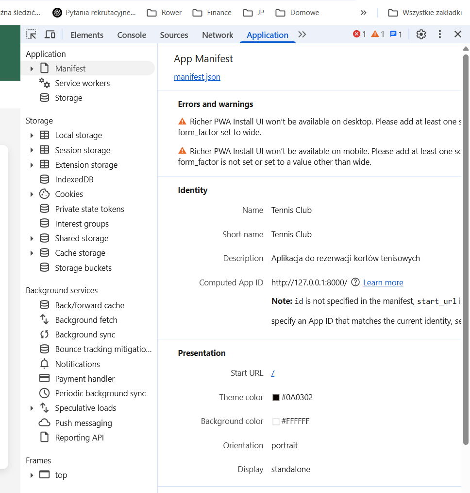

* worker is registered
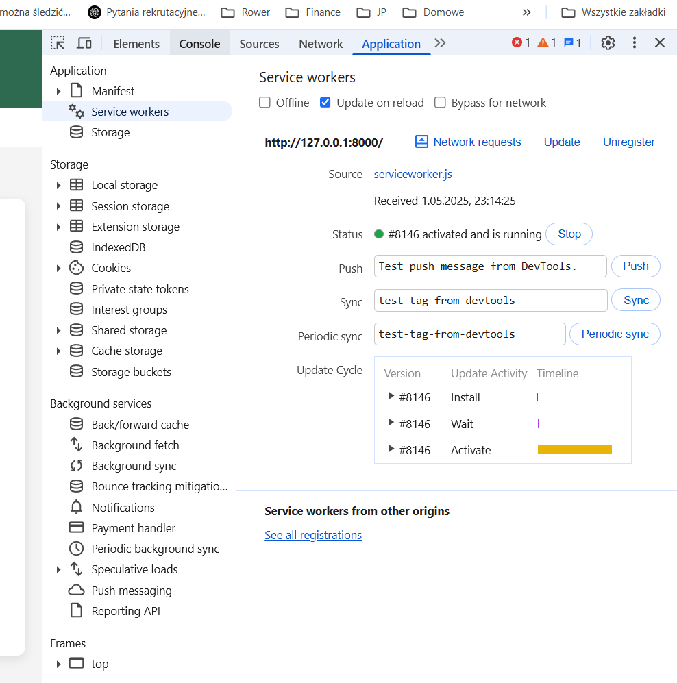

* application can work in offline mode
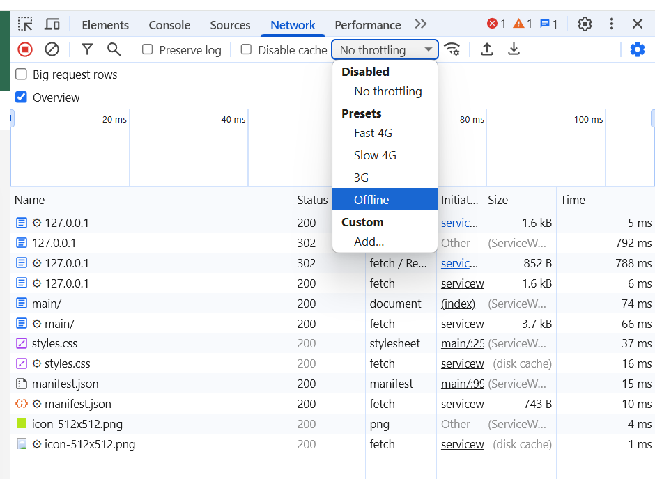
